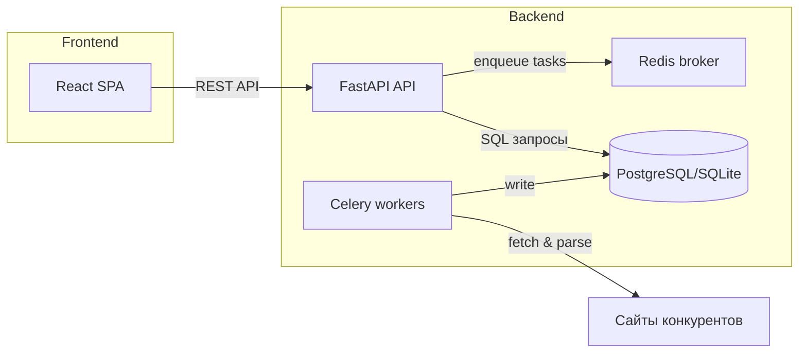

# PriceSpy Documentation

## 1. Архитектура проекта

### 1.1 Диаграмма компонентов



### 1.2 Взаимодействие фронтенда и бэкенда

* **React SPA** запрашивает данные через HTTP к FastAPI (JSON).
* Бэкенд валидирует запросы, обращается к базе данных и возвращает JSON.
* Для фонового сбора цен бэкенд кладёт задачи в Redis, а Celery-воркеры периодически берут их и сохраняют результаты в БД.

---

## 2. Описание API

### 2.1 Swagger / OpenAPI

FastAPI автоматически генерирует спецификацию OpenAPI:

* **Swagger UI**: `http://localhost:8000/docs`
* **ReDoc**: `http://localhost:8000/redoc`

### 2.2 Основные эндпоинты и примеры

#### Аутентификация

* **POST /token** — получить JWT

```bash
curl -X POST http://localhost:8000/token \
  -F "username=demo" -F "password=secret"
```

```json
{ "access_token": "ey...", "token_type": "bearer" }
```

#### Products

* **GET /products** — список продуктов
* **POST /products** — создать продукт
* **DELETE /products/{product\_id}** — удалить продукт

```bash
curl -X POST http://localhost:8000/products \
  -H "Authorization: Bearer $TOKEN" \
  -H "Content-Type: application/json" \
  -d '{"name":"MyProduct"}'
```

#### Prices

* **GET /prices?product\_id=1** — история цен
* **POST /prices** — добавить запись цены

```bash
curl -X POST http://localhost:8000/prices \
  -H "Authorization: Bearer $TOKEN" \
  -H "Content-Type: application/json" \
  -d '{"product_id":1,"competitor_id":2,"price":99.99,"url":"http://...","date":"2025-06-27"}'
```

#### Ozon Integration

* **POST /ozon/products/{product\_id}/fetch** — собрать цену с Ozon для конкретного продукта
* **POST /ozon/products/fetch\_all** — собрать цены для всех продуктов

---

## 3. Инструкции по развёртыванию

### 3.1 Установка зависимостей

```bash
# Backend
pip install --upgrade pip
pip install -r requirements.txt

# Frontend
cd frontend
npm install
```

### 3.2 Конфигурация окружения

1. Скопируйте `.env.example` → `.env`
2. Заполните:

   * `DATABASE_URL` — URL вашей БД (PostgreSQL)
   * `REDIS_URL` — URL Redis
   * `SECRET_KEY` — сгенерированная секретная строка

### 3.3 Запуск с Docker

```bash
# Собрать образы и поднять сервисы
docker-compose up -d --build
```

* Backend: `http://localhost:8000`
* Frontend: `http://localhost:3000`

---

## 4. Руководство пользователя

### 4.1 Основные функции

1. **Просмотр продуктов** — страница со списком продуктов и текущими ценами.
2. **Добавление продукта** — создание нового товара через форму.
3. **История цен** — интерактивный график динамики цен.
4. **Ручной сбор цен** — кнопка «Fetch Ozon Price» на карточке продукта.

### 4.2 Инструкция для конечного пользователя

1. Перейдите на страницу **Login**, введите логин/пароль.
2. На **Products** нажмите **Add Product**, заполните форму и подтвердите.
3. Чтобы посмотреть график, кликните по записи в списке.
4. Для ручного обновления цены нажмите **Fetch Ozon Price** рядом с товаром.
